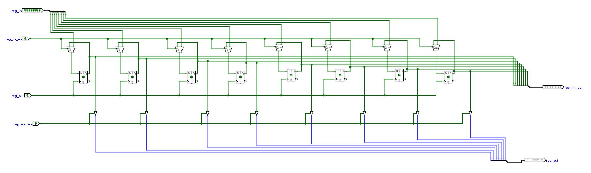

# Designing a SAP-1 Architecture of Microprocessor

The SAP-1 computer, which represents the first stage in this progression, is equipped with all of the necessary components to work. The main goal of the course is to give students a fundamental grasp of how computers operate, interact with memory, and connect with other system components like input and output. The instruction set is relatively small and straightforward.

## Table of Content

1. [SAP-1 Architecture](#sap-1-architecture)
   - [SAP-1 Components](#sap-1-components)
2. [Design Process](#design-process)
   - [General Purpose Register](#general-purpose-register)
   - [Arithmetic Logic Unit (ALU)](#arithmetic-logic-unit-alu)
   - [Program Counter](#program-counter-pc)
   - [4x16 Decoder](#4x16-decoder)
   - [Random-Access Memory (RAM)](#random-access-memory-ram)
   - [Instruction Register](#instruction-register-ir)
   - [Complete Circuit Diagram of SAP Architecture](#complete-circuit-diagram-of-sap-architecture)

<!-- 3. [Implementation Process](#implementation-process)
4. [Results](#results)
   - [Programmed FPGA](#programmed-fpga)
   - [Operation Codes](#operation-codes)
5. [Learn More](#learn-more)
   - [Reference 1](#reference-1)
   - [Reference 2](#reference-2)
   - [Reference 3](#reference-3)
   - [Reference 4](#reference-4) -->

## SAP-1 Architecture

The SAP-1 computer utilizes Von-Neumann architecture and is bus-organized. It contains ten major components and an 8-bit core bus. Below is a picture of the building's architecture. The description of each component that makes up this computer follows.

### SAP-1 Components

1. **Program Counter**: The function of the program counter is to send and save the memory address of the subsequent instruction that has to be retrieved and executed. The control unit's program counter, which counts from 0000 to 1111, is a component. The program counter delivers the next address, 0001, to the memory once the first instruction has been fetched and performed, and it is then incremented once more. The program counter maintains track of the following instruction that needs to be fetched and performed in this manner.

2. **Memory Address Register (MAR)**: The 4-bit address of data or instructions stored in memory is kept in the Memory Address Register (MAR). The 4-bit address is obtained from the Program Counter through the bus and then stored when the SAP-1 is executing. The RAM is where data or instructions are read from when this stored address is sent there.

3. **Random-Access Memory (RAM)**: The 4-bit address of data or instructions stored in memory is kept in the Memory Address Register (MAR). The 4-bit address is obtained from the Program Counter through the bus and then stored when the SAP-1 is executing. The RAM is where data or instructions are read from when this stored address is sent there.

4. **Instruction Register**: The instruction takes the instruction from the RAM that was put on the bus and stores it. The instruction register's contents are then divided into two bits. The bottom nibble is a three-state output that is read off the bus as necessary, while the top nibble is a two-state output that goes into the Controller-sequencer.

5. **General Purpose Register**: The General Purpose Register is a buffer register used store 8-bit data. It supplies the data to the Arithmetic Logic Unit (ALU) to add/subtract. 

6. **Arithmetic Logic Unit (ALU)**: The Arithmetic Logic Unit (ALU) asynchronously adds or subtracts a value from the A-Register and B-Register. To do this, it makes advantage of the complement of 2. The output of the ALU is the sum of these values when Su is low, and the subtraction of these values when Su is high.

## Design Process

<!-- 
 
_Instruction Register_

 -->

Circuit schematics were created for each part of the microprocessor used to form the SAP-1 architecture. Using buses, these components were subsequently combined into a single system. Using Logisim, a program for creating and simulating logic circuits, each circuit diagram was created and tested.

### Program Counter
This counter stores the current step to be processed from the RAM. Basically, this counts the lines of our program. So, at 0000, first line of the program is executed and at 0001 the second line is executed. The output can be enabled using “pc_en” pin. This is made using cascaded master-slave JK flip-flops. 

 
_Figure 1: Program Counter_

### General Purpose Register
The General Purpose Register is a buffer register used in performing arithmetic operations. We used two General Purpose Register, one is A-Register and another is B-Regisrer. It supplies the number to be added or subtracted from the contents of the accumulator to the adder/subtractor. When data is available at the bus and La is high, at the positive clock edge, B register gets and stores the data. 
Register stores a bit using a Flip-flop. Flip-flops are edge triggered device. That’s why clock is needed to store data to D flip-flop. Multiplexer is also used for get similar data if input of register is not given. Control buffer is used to control the output of the register. A clock signal given for synchronizing signal with other devices. 

 
_Figure 2: General Purpose Register_

### Arithmetic Logic Unit (ALU)
The ALU or Arithmetic & Logic Unit does all the actual calculations in a processor. For simplicity, out ALU will only include an adder and a subtractor. You may any other functionality as you wish. The process begins with placing 8 single bit full adders. These full adders are then cascaded to create an 8-bit Ripple Carry Adder. One side of the adder is added input 1 coming from A-register and the other input is taken through a set of XOR gates, whose signal comes from B-register. The other inputs of the XOR gates are connected to ′𝑎𝑙𝑢_𝑠𝑢𝑏′ and is used to invert the value coming from B-register to generate 1’s complement. Same signal is added to carry in for 2’s complement while using this pin for subtraction. The output of the ALU is transferred through a Tristate buffer and connected to ′𝑎𝑙𝑢_𝑜𝑢𝑡′. The buffer is controlled by the ′𝑎𝑙𝑢_𝑜𝑢𝑡_𝑒𝑛′. 

 
_Figure 3: Arithmetic Logic Unit (ALU)_

### Program Counter (PC):
This counter stores the current step to be processed from the RAM. Basically, this counts the lines of our program. So, at 0000, first line of the program is executed and at 0001 the second line is executed. The output can be enabled using “pc_en” pin. This is made using cascaded master-slave JK flip-flops. 

 
_Figure 4: Program Counter (PC)_

### 4x16 Decoder:
A decoder is a combinational circuit with up to 2n output lines and n number of select bits. For a given combination of input bits, the decoder will only ever have one of its outputs active. We would use a 4 to 16 decoder in this instance, which has 4 selection lines and 16 output lines. The 16 separate addresses in our RAM, which we will create next, will be accessed using these 16 output lines. The schematic of the decoder can be seen in figure 5.

 
_Figure 5: 4x16 Decoder_

### Random Access Memory (RAM):
RAM is a memory that can store data randomly. In this SAP architecture we used 8 bits RAM with 16 memory location. Each location can store 8 bits of data and location can be selected using 4x16 decoder. 
Here each memory location made by 8 bits register, that has input pin ‘data_in’, clock pin ‘clk’, chip select pin ‘cs’ and output pin ‘wr_en’. A single RAM cell can be seen in figure 6.

 
_Figure 6: Single SRAM Cell_

Using this single RAM cell 16 times we can create a whole RAM, that is shown in figure 3.
This RAM can take input 4 bits data as input as memory address register suing ‘mar_in_en’ pin and select the chip to store or fetch data from the RAM. Data can be stored by using ‘data_in’ and ‘wr_en’ pin and data also can be fetched by using ‘rd_en’ pin. 
In RAM data is stored in a location and address of this location also stored. First of all, we store two address in RAM and store two data in this location, then load these two data in A-Register and B-Register. Then ALU sum this and store the result in another location in RAM. The design of the RAM can be seen from figure 7.

 
_Figure 7: Complete SRAM_

### Instruction Register (IR):
The instruction that is now being executed is stored in the instruction register. This divides the BUS data into two 4-bit chunks. The lower 4 bits are the operands or addresses, and the upper 4 bits are the Opcode. It has ‘ins_reg_in_en’ pin to enable the input pin in Instruction Register and also has output pin for 4 LSB data. The schematic of the instruction register can be seen in figure 8.

 
_Figure 8: Instruction Register (IR)_

### Complete Circuit Diagram of SAP Architecture:
Now we have all the necessary parts for making our very own processor. At this time, we assemble all parts of the processor as shown in the figure 7. Various parts of the processor are now linked through the help of the central BUS. The control pins of all the subcircuits are tunneled to a unified spot for the ease of manipulations. A debug control and debug data pins are also added to the bus in order to program the RAM. At this time, we would need one final component, the control sequencer or control unit. This control unit controls the control BUS to manipulate the various control pins to ensure proper function. This is out of the reach for our lab and we shall run the processor manually to understand how it works. This is shown in figure 9.

 
_Figure 9: Complete Circuit Diagram of SAP Architecture_

